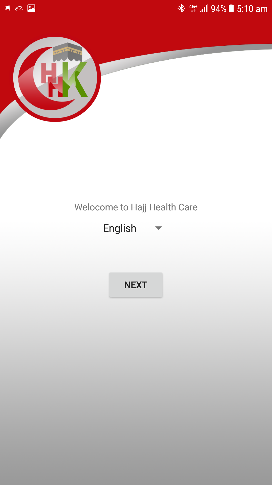
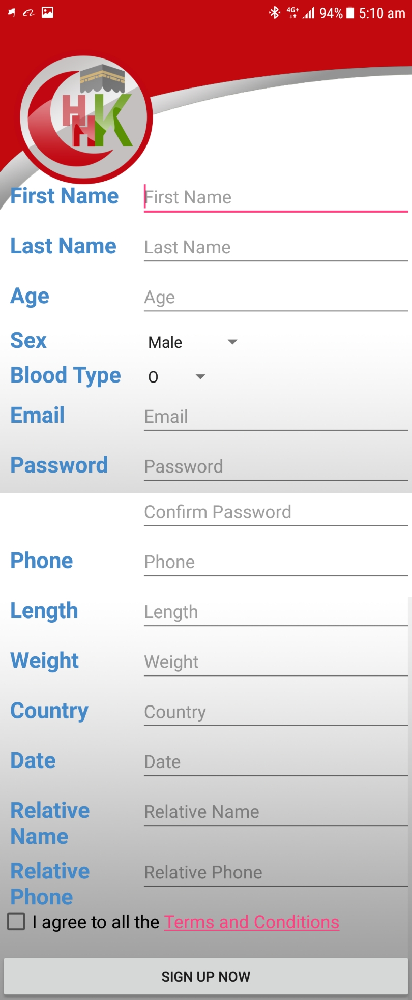
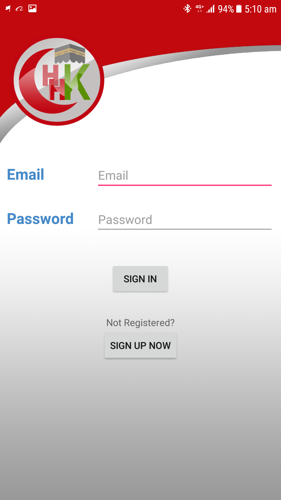
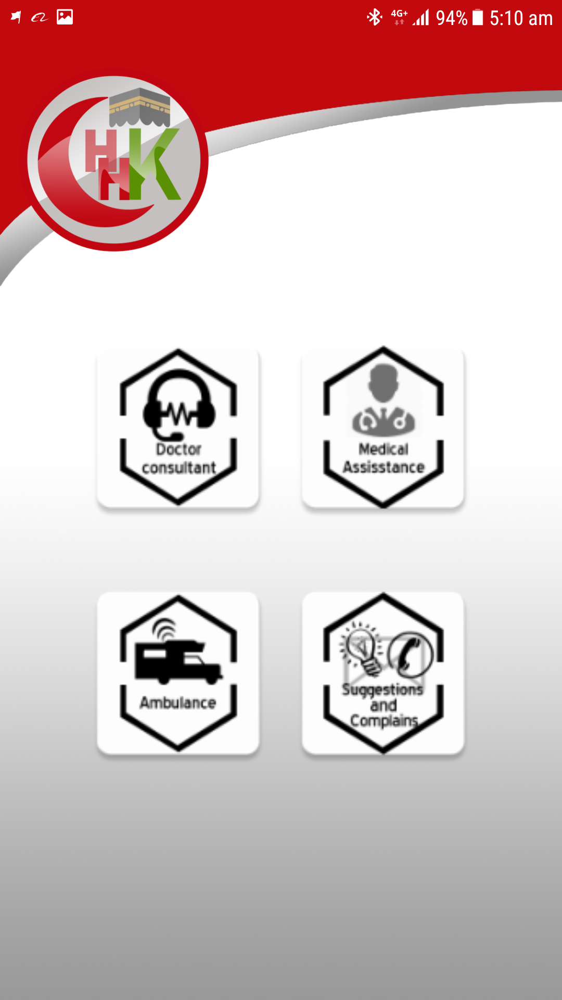
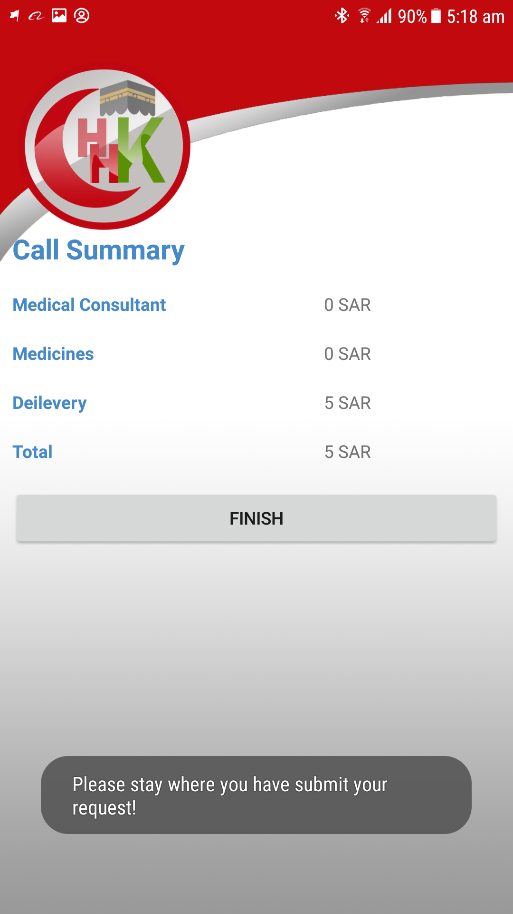
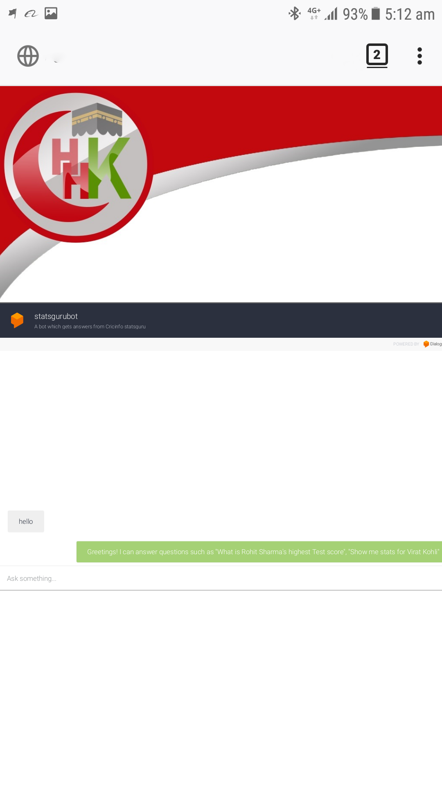
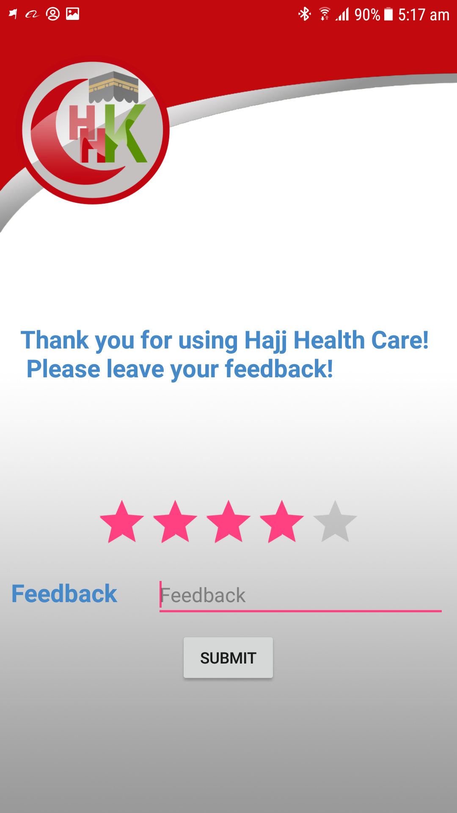
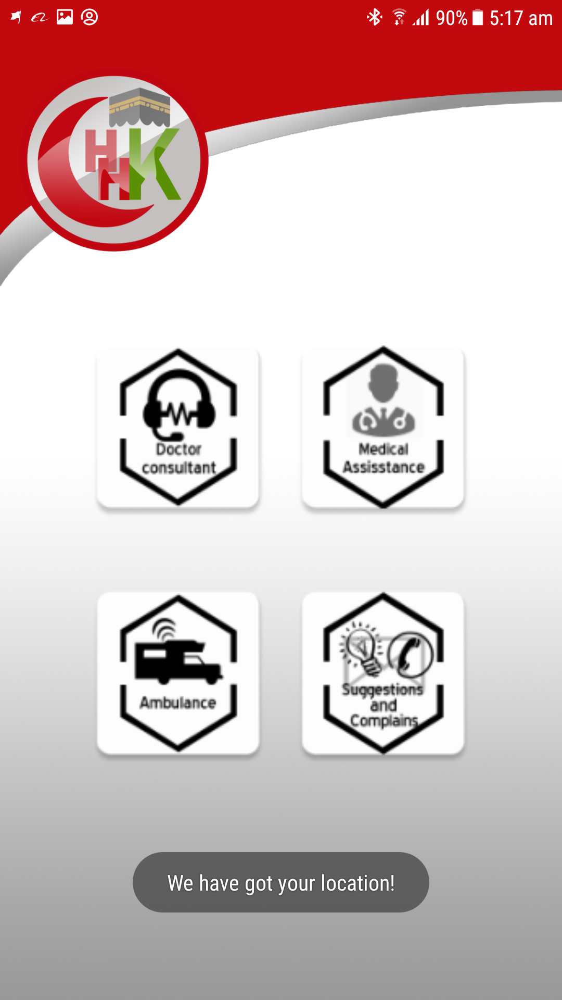
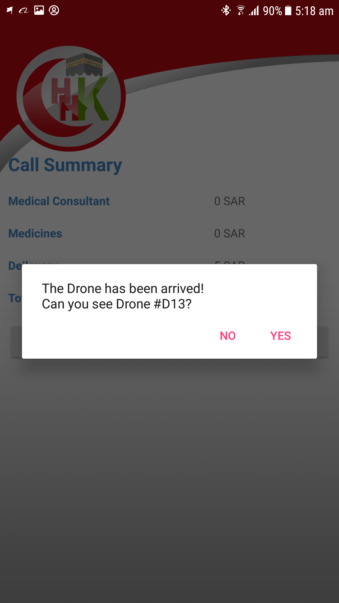
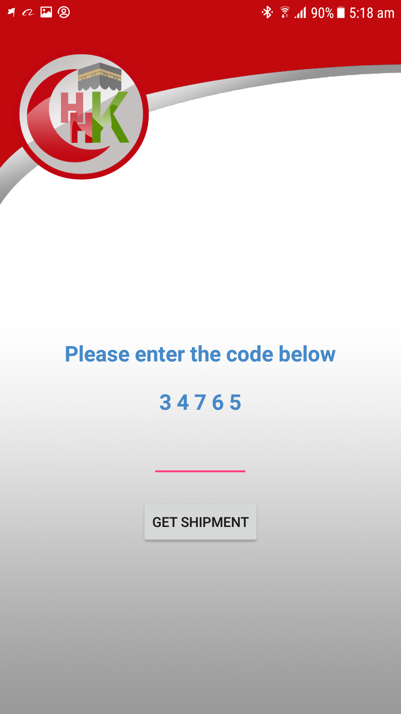

<!DOCTYPE html>
<html>
<head>
	<title>HealthCare</title>
  	<link href="css/styles.css" rel="stylesheet">
</head>
<body>

	<h1>HealthCare</h1>

<pre>
The Application aims to insure a better health for people during medical emergency.

We have found that people are facing a challenge in getting their medical services in short time in many circumstances and there may be many obstacles that can cause delay in helping them.

We have came up with a idea to enhance and speed up the facility of healthcare in multiple ways.
</pre>

<h2>Features</h2>

<ul>
	<li>Video call with doctors</li>
	<li>Requesting and delivering medicine using drons</li>
	<li>Medical Chat Bot</li>
  </ul>

	

		

			<h2>Application Screens</h2>

			

				Welcome Screen
			

			

				Sign Up Screen
			

			

				Sign In Screen"
			

			

				Main Services Menu
			

			

				Medical Assisstance Service
			

			

				Doctor Call
			

			

				Doctor Call Summary
			

			

				Doctor Consultant Service
			

			

				Sugestions and Complains Screen
			

			

				Ambulance Request
			

			

				Drone Message
			

			

Drone Verification Code

		

	

</body>
</html>

